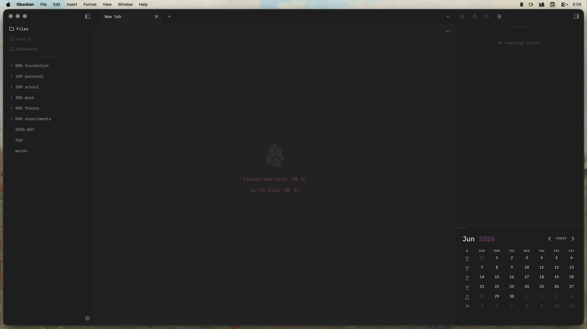

# Obsidian
Here is a snapshot of my core Obsidian settings. If you wish to copy my setup, then I highly recommend you follow the agent-assisted instructions.

## File Structure
| Path | Purpose |
| --- | --- |
| `.obsidian/app.json` | editor & general settings |
| `.obsidian/appearance.json` | theme, accent color, ribbon |
| `.obsidian/hotkeys.json` | custom hotkeys |
| `.obsidian/graph.json` | graph view settings |
| `.obsidian/page-preview.json` | page preview settings |
| `.obsidian/core-plugins.json` | enabled core plugins |
| `.obsidian/community-plugins.json` | enabled community plugins |
| `.obsidian/themes/Baseline/manifest.json` | active theme (**Baseline**) |

## Install

### Agent-Assisted
Point your agent (e.g., Claude Code, Codex, OpenCode) at this folder with the following prompt:

> Replicate the Obsidian setup in this folder for my vault.
> 1. Find my vault's `.obsidian/` directory (ask me if unsure), and back it up first.
> 2. Copy every `*.json` from this `.obsidian/` into my vault's `.obsidian/`, **without** touching my `workspace.json`, `workspace-mobile.json`, or `bookmarks.json`.
> 3. Install the community plugins named in `community-plugins.json` and the **Baseline** theme (from `themes/Baseline/manifest.json`); enable the core plugins listed in `core-plugins.json`.
> 4. **Copy files — never symlink.** Then tell me to restart Obsidian.

### Manual
1. Install the plugins in `community-plugins.json` and the **Baseline** theme from Obsidian.
2. Copy the `*.json` files from `.obsidian/` into your vault's `.obsidian/`, merging — leave your own `workspace*.json` / `bookmarks.json` alone.
3. Restart Obsidian.
